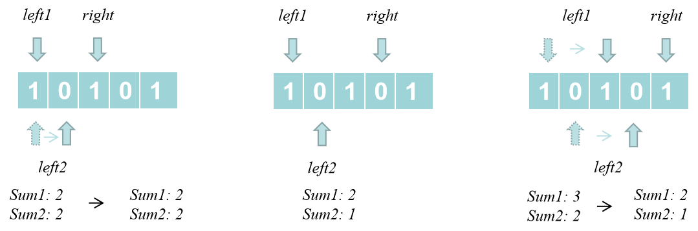

#### [930. 和相同的二元子数组](https://leetcode-cn.com/problems/binary-subarrays-with-sum/)

给你一个二元数组 nums ，和一个整数 goal ，请你统计并返回有多少个和为 goal 的 **非空** 子数组。

**子数组** 是数组的一段连续部分。

 

**示例 1：**

> **输入：**nums = [1,0,1,0,1], goal = 2
> **输出：**4
> **解释：**
> 如下面黑体所示，有 4 个满足题目要求的子数组：
> [**1,0,1**,0,1]
> [**1,0,1,0**,1]
> [1,**0,1,0,1**]
> [1,0,**1,0,1**]

**示例 2：**

> **输入：**nums = [0,0,0,0,0], goal = 0
> **输出：**15


**提示：**

* 1 <= nums.length <= $3 * 10^4$
* nums[i] 不是 0 就是 1
* 0 <= goal <= nums.length


**解析：**

前缀和 + 哈希表，涉及到子数组问题，首先想到使用前缀和

**代码：**

```java
class Solution {
    public int numSubarraysWithSum(int[] nums, int goal) {
        int n = nums.length;
        int[] preSum = new int[n+1];
        preSum[0] = 0;
        for (int i=1; i<=n; ++i) {
            preSum[i] = preSum[i-1] + nums[i-1];
        }

        int res = 0;
        Map<Integer, Integer> map = new HashMap<>();
        map.put(0, 1);
        for (int i=1; i<=n; ++i) {
            res += map.getOrDefault(preSum[i] - goal, 0);
            map.put(preSum[i], map.getOrDefault(preSum[i], 0) + 1);
        }
        return res;
    }
}
```


**优化：**

需要注意，前缀和数组的构成可以和哈希表查询同步构建，没有必要进行两次循环。

**代码：**

```java
class Solution {
    public int numSubarraysWithSum(int[] nums, int goal) {
        int n = nums.length;
        int res = 0, sum = 0;
        Map<Integer, Integer> map = new HashMap<>();
        map.put(0, 1);
        for (int i=1; i<=n; ++i) {
            sum += nums[i-1];
            res += map.getOrDefault(sum - goal, 0);
            map.put(sum, map.getOrDefault(sum, 0) + 1);
        }
        return res;
    }
}
```


**解法二：**

滑动窗口，由于题目中数组为二元组数组，对于每一个数组下标 $j$  ，当其满足 $preSum[j] - preSum[i] = goal$ 的条件时，对应 $i$ 为一个连续区间，若能够求得 $i$ 的左右边界 $left1$ 与 $left2$，则此时共有 $left2 - left1$ 个子数组满足条件。

因此构建一个滑动窗口，随着其右边界 $j$ 右移，其相应的两个左边界 $left1$ 与 $left2$ 也会随之移动。在移动过程中，我们要找到这两个左边界，使得 $[left1, left2)$  区间内任一数组下标 $i$ 到 $j$ 的子数组之和为 $goal$。两个左边界通过窗口之和 $sum1$ 与 $sum2$ 求取，当窗口之和  $sum1$ 大于目标值时，$left1$ 右移。当窗口之和  $sum2$ 大于等于目标值时，$left2$ 右移。



**代码：**

```java
class Solution {
    public int numSubarraysWithSum(int[] nums, int goal) {
        int n = nums.length, res = 0;
        for (int left1=0, left2=0, right=0, sum1=0, sum2=0; right<n; ++right) {
            sum1 += nums[right];
            sum2 += nums[right];
            while(left1 <= right && sum1 > goal) {
                sum1 -= nums[left1];
                left1++;
            }
            while(left2 <= right && sum2 >= goal) {
                sum2 -= nums[left2];
                left2++;
            }
            res += left2 - left1;
        }
        return res;
    }
}
```

